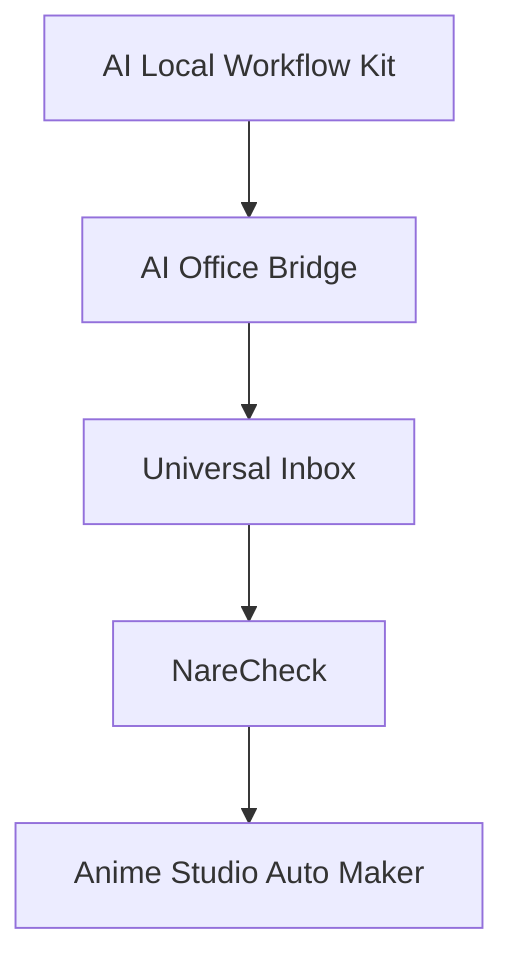

# AI Local Workflow Kit

AI Local Workflow Kit is a local-first toolkit for safer AI-assisted file work.

It provides simple rules, templates, and scripts for:

- creating backups before editing files
- saving work logs
- generating structured reports
- preparing handoff files for AI coding agents
- keeping destructive operations under human approval

This project is designed for people who want to use AI coding tools safely with local files, without exposing unnecessary data or relying on complex infrastructure.

## Core idea

AI agents should not freely modify or delete important files.

This kit separates work into safe stages:

1. Read files
2. Analyze files
3. Create reports
4. Create backups
5. Prepare proposed changes
6. Ask for human approval before writing
7. Save logs after every action

## Architecture

AI Local Workflow Kit provides the safety foundation used across a growing family of local-first AI workflow projects.

The relationship is intentionally practical:

- AI Local Workflow Kit defines the common safety rules, approval patterns, backups, logs, and handoff structure.
- AI Office Bridge applies those patterns to local office workflows.
- Universal Inbox expands the workflow layer for intake, review, and task routing.
- NareCheck validates review, quality control, and approval workflows in a real production-adjacent tool.
- Anime Studio Auto Maker validates larger AI-assisted creative operations with stronger safety and logging needs.

## Who is this for?

- small teams
- solo developers
- non-engineers using AI tools
- maintainers who want safer AI-assisted workflows
- people building local-first AI productivity tools

## Status

Early public version.

This repository is intentionally simple and practical.
The goal is to provide a reusable foundation for safe local AI workflows.

## Real World Validation

This toolkit is actively validated through multiple real-world projects.

- AI Office Bridge
- Universal Inbox
- NareCheck
- Anime Studio Auto Maker

These projects are used to test workflow safety, backups, approval systems, logging, and AI-assisted operations.

## License

MIT

## Vision

AI agents are becoming more powerful, but many users still lack safe workflows for working with local files.

This project aims to provide a reusable foundation for safe AI-assisted work.

## Why this project exists

Many AI tools focus on generation.

This project focuses on safety:

- backups
- approvals
- logs
- reports
- handoff templates

## Related Projects

This repository is being tested and expanded through several real-world projects:

- AI Office Bridge
- Universal Inbox
- NareCheck
- Anime Studio Auto Maker

## Safety Principles

1. Read before modify
2. Backup before change
3. Human approval before overwrite
4. Log every action
5. Avoid destructive operations

## Project Goals

### Short term

- Approval workflows
- Backup verification
- AI handoff templates

### Mid term

- Local-first AI workflow engine
- Multi-agent coordination

### Long term

- Safe AI operating layer for local AI systems

## Roadmap

- Approval workflow
- Backup verification
- AI handoff templates
- Local-first AI operations
- Multi-agent workflow support
