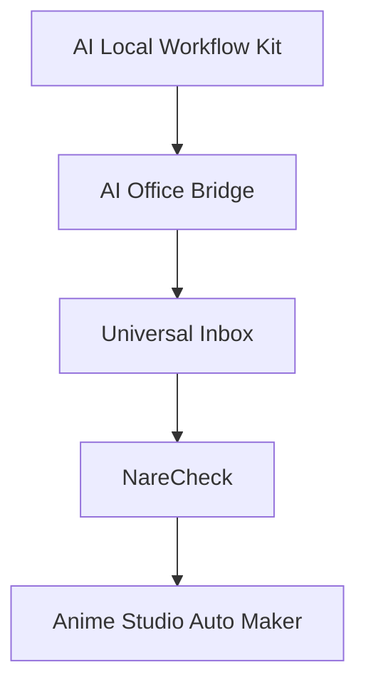

# Architecture

AI Local Workflow Kit is the safety and workflow foundation for a family of local-first AI projects.

It does not try to be a large platform first. Instead, it defines practical rules and reusable documentation patterns that can be applied across real projects where AI agents interact with local files, logs, reports, and handoff documents.

## Project Relationship

## Layers

### AI Local Workflow Kit

AI Local Workflow Kit is the foundation layer.

It defines the shared operating principles:

- read before modify
- backup before change
- human approval before overwrite
- log every action
- avoid destructive operations by default
- prepare clear AI handoff documents

The kit is intentionally small so that it can be reused by different local-first AI workflows without requiring complex infrastructure.

### AI Office Bridge

AI Office Bridge applies the foundation to office-style local workflows.

It is used to validate whether the kit can support practical file operations such as preparing documents, reviewing local materials, organizing outputs, and keeping work logs understandable for non-engineers.

This layer tests whether the safety rules are useful in daily productivity work.

### Universal Inbox

Universal Inbox extends the workflow model into intake, review, and routing.

It is used to test how incoming tasks, files, or requests can be organized before an AI agent acts on them. This is important because safe AI workflows need a clear boundary between receiving information, analyzing it, proposing an action, and executing that action only after approval.

This layer validates task intake and triage patterns.

### NareCheck

NareCheck validates review, quality control, and approval workflows.

It is used as a production-adjacent project where outputs need to be checked, marked, and reviewed. This helps test whether approval flows, logs, and human-readable reports are clear enough for repeated practical use.

This layer validates quality checks and human decision points.

### Anime Studio Auto Maker

Anime Studio Auto Maker validates larger AI-assisted creative workflows.

It is used to test whether the safety foundation can support longer workflows with more moving parts, including generated assets, process logs, handoffs, and recovery points.

This layer validates scale, continuity, and operational safety in creative production.

## Design Direction

The architecture grows from small safety rules toward larger local AI operations.

The intended direction is:

1. define safe local file workflow rules
2. validate them in small office workflows
3. expand them into inbox and routing workflows
4. test quality control and approval loops
5. apply them to larger creative AI operations

## What This Architecture Avoids

This project intentionally avoids:

- uncontrolled file modification
- automatic destructive operations
- hidden external communication
- replacing human approval with silent automation
- complex infrastructure before workflow safety is proven

## Current Status

The architecture is early but actively validated.

The immediate goal is to keep the foundation understandable, reusable, and safe while real-world projects continue to test where the rules need to become clearer or stronger.
